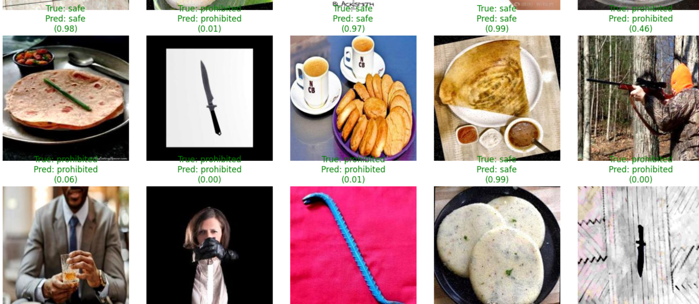

# LeanGuard: Harmful Object Detection System

## Introduction

**LeanGuard** is a lightweight computer vision-based object detection system designed to classify real-world items as either **Prohibited** or **Safe**. It aims to assist in monitoring environments (e.g., public spaces, institutions, schools, airports) where detecting harmful or unauthorized items such as weapons, alcohol, or sharp objects is crucial.

This project is built using the **YOLOv9** object detection model and trained on a custom dataset of harmful and safe objects. The focus is on creating a fast and accurate system that can be deployed in security pipelines or surveillance tools.

---

## Key Features

- Detects objects and classifies them into:
  - `Prohibited` (e.g., guns, knives, alcohol)
  - `Safe` (e.g., food)
- High-speed inference using YOLOv9
- Trained on a custom annotated dataset
- Visual testing with random test samples
- Easily extendable to add more categories

---

## Why This Project?

With increasing safety concerns in educational and public institutions, there's a growing need for lightweight AI tools that can aid human monitoring. LeanGuard is designed to bridge this gap by:

- Automatically detecting harmful objects in video or image feeds
- Helping institutions maintain safer environments
- Providing an efficient and low-cost alternative to full surveillance teams

---

## Model Training

- Model: `yolov9c.pt` (YOLOv9 segmentation variant)
- Annotation Tool: **Roboflow**
- Image Preprocessing:
  - Auto-orientation
  - Resize to 640x640
  - Augmentations:
    - Crop (Zoom 0–20%)
    - Brightness ±15%
    - Saturation ±25%
    - Exposure ±10%
- Dataset Split:
  - **Train:** 82% (6795 images)
  - **Validation:** 11% (867 images)
  - **Test:** 7% (592 images)

---

### Lean Guard Detection Preview


## Installation & Usage

1. **Clone the repository**

```bash
git clone https://github.com/MariyamChauhdry/Lean-Guard.git
cd LeanGuard
